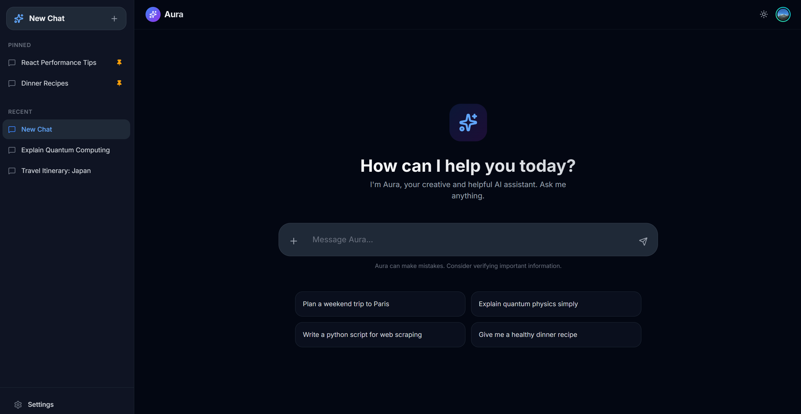
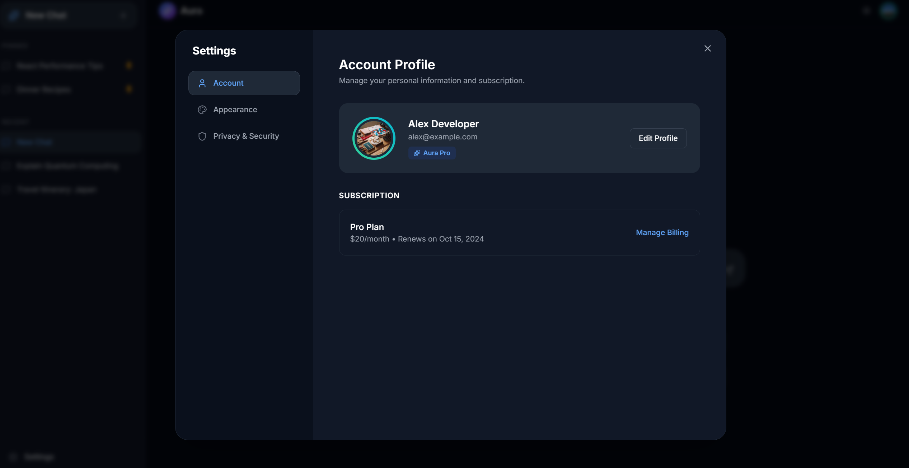
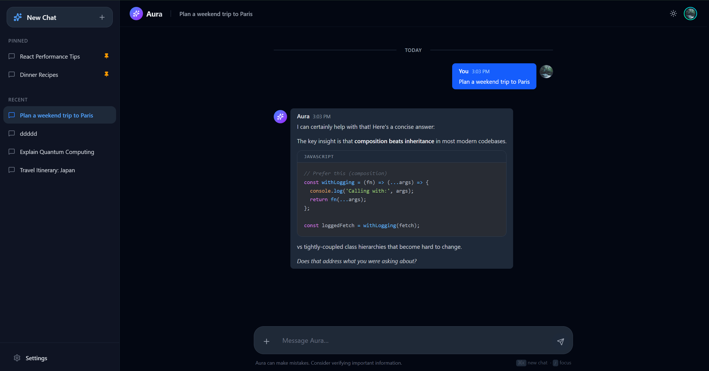

# Aura Chat — AI Chat UI Template

> A production-ready frontend template for building AI chat interfaces.  
> Bring your own backend. Ship in days, not weeks.

---

## Why This Exists

Every AI product eventually needs a chat interface. Most teams build the same thing — a message list, a text input, a sidebar, a theme toggle — over and over again, from scratch, burning time on UI plumbing instead of what actually differentiates their product.

**Aura is the starting point you wish you had.**

It's a fully-featured, visually polished chat UI built with the modern React stack. It handles the entire interface layer — streaming responses, markdown rendering, keyboard shortcuts, toast feedback, and a clean message layout — right out of the box. You wire up your API, and you're live.



---

## What's Included

### A Chat Interface That Feels Real

Forget placeholder UIs. Aura ships with the features users expect from a polished AI product:

- **Multi-session sidebar** — pinned and recent conversations, create/switch at any time
- **Streaming AI responses** — tokens appear progressively, like watching a real LLM think
- **Markdown rendering** — bold, code blocks, tables, lists, blockquotes — all beautifully styled
- **Conversational bubble layout** — your messages on the right, AI on the left, with clear color differentiation


### The Details That Make It Feel Polished

- **Toast notifications** — instant feedback for copy, delete, edit, and regenerate
- **Keyboard shortcuts** — `⌘K` new chat, `/` focus input, `⌘⇧S` toggle sidebar
- **Typing indicator** — animated dots while the AI is "thinking"
- **Smooth animations** — fade-in-up on messages, pulse on the streaming cursor
- **Light / Dark mode** — system-aware toggle with smooth transitions
- **Responsive layout** — sidebar adapts from desktop drawer to mobile overlay
- **Auto-expanding input** — grows as you type, up to 200px, then scrolls

### Built-in Settings Panel

Extensible settings modal with Account, Appearance, and Privacy tabs — ready for your own options without needing to build the shell from scratch.



### Engineering Quality

- **React 18 + TypeScript** — strict mode, fully typed throughout
- **Tailwind CSS v4** — zero unused styles in production
- **Custom hooks** — `useTheme`, `useChats`, `useUIState`, `useKeyboardShortcuts`
- **React Context** — clean action dispatch, no prop drilling
- **ESLint + Prettier** — enforced code style from the start
- **Vite** — instant HMR, fast production builds (~135 kB gzipped)

---

## Get Started

```bash
git clone https://github.com/your-org/aura-chat-template
cd aura-chat-template
npm install
npm run dev
```

Open `http://localhost:5173`. You're looking at your new chat interface.

```bash
npm run build     # Production build
npm run preview   # Preview the production build
```

---

## Backend Agnostic by Design

Aura has no opinion about your backend. There's no API baked in — just a `streamMockAiResponse()` function in `services/mockAiService.ts` that you replace with your own streaming integration.

```ts
// services/mockAiService.ts  →  replace with your real integration

export function streamMockAiResponse(
  onChunk: (chunk: string) => void,
  onDone: () => void
): () => void {
  // Drop in: OpenAI streaming, Anthropic SSE, Azure, Ollama — anything
  // Return a cancel function to abort mid-stream
}
```

Works with any AI provider:

| Provider | Integration |
|---|---|
| OpenAI / GPT-4o | `openai` SDK with streaming |
| Anthropic / Claude | `@anthropic-ai/sdk` SSE |
| Google Gemini | `@google/generative-ai` |
| Azure OpenAI | `openai` SDK (Azure endpoint) |
| Ollama (local) | `fetch` to `localhost:11434` |
| Your own API | Any `fetch` / SSE / WebSocket |

Streaming, tool calling, function execution — none of that requires touching the UI layer. Drop it into the service, and tokens flow straight into the chat.

---

## Tier 1 Features — What Was Built

These are the four high-impact features that were implemented on top of the base template to bring it to production quality.

---

### 1. Real-time Message Streaming

AI responses stream progressively into the chat — just like ChatGPT or Claude.ai — instead of appearing all at once after a delay.

**How it works:**
- A fixed-interval batching approach fires every 40ms (25 fps) and sends 3 words per tick
- This caps React re-renders at ~25 per second regardless of response length
- A blinking cursor pulses at the end of the message while streaming is in progress
- Switching chats or starting a new conversation cleanly cancels any in-flight stream

**Why it matters:** The naïve approach (one `setState` per token) causes ~200 state updates per response and visibly hangs the renderer. The batching approach eliminates that entirely.

```ts
// The streaming API shape — replace the internals with your backend
export function streamMockAiResponse(
  onChunk: (chunk: string) => void,   // called every 40ms
  onDone: () => void                  // called when stream ends
): () => void                         // returns cancel function
```

---

### 2. Markdown Rendering with Syntax Highlighting

AI responses are parsed as Markdown and rendered with full formatting — inline code, fenced code blocks with syntax highlighting, tables, blockquotes, headings, and lists.

**What renders:**

| Element | How It Looks |
|---------|-------------|
| Code blocks | Dark `oneDark` theme, language badge, rounded border |
| Inline code | Pink monospace pill on a subtle gray background |
| Bold / Italic | Proper font-weight and italic treatment |
| Blockquotes | Blue left border, light blue tinted background |
| Tables | Bordered rows, responsive horizontal scroll |
| Headings | h1 → h3 with proper size hierarchy |
| Lists | Indented with spacing, both ordered and unordered |

**Bundle-conscious:** Uses `PrismLight` (the lightweight Prism build) with only 7 languages manually registered — TypeScript, TSX, JavaScript, Python, Bash, JSON, and CSS. This avoids bundling all ~200 languages, saving ~500 kB.

---

---

### 3. Toast Notifications for Instant Feedback

Every destructive or clipboard action gives immediate visual confirmation via non-intrusive toast notifications in the top-right corner.

| Action | Notification |
|--------|-------------|
| Copy message | ✅ "Copied to clipboard" (green) |
| Delete message | 🗑 "Message deleted" (red) |
| Edit message | ✅ "Message updated" (green) |
| Regenerate response | ⏳ "Regenerating..." → ✅ "Done" |

Powered by [`sonner`](https://sonner.emilkowal.ski/) — auto-dismisses after 3 seconds, respects dark mode, supports manual close, and stacks gracefully when multiple actions fire in quick succession.

---

### 4. Keyboard Shortcuts for Power Users

Navigate and interact with the entire UI without leaving the keyboard.

| Shortcut | Action |
|----------|--------|
| `⌘K` / `Ctrl+K` | Start a new chat |
| `⌘⇧S` / `Ctrl+Shift+S` | Toggle the sidebar |
| `/` | Jump focus to the message input |

A persistent hint bar below the input reminds users of the most useful shortcuts. On mobile it hides automatically to save space.

Platform-aware: automatically uses `Cmd` on macOS and `Ctrl` on Windows/Linux.

---

### Chat Bubble Layout

Messages are now laid out like a real conversation — **your messages on the right** in blue, **AI responses on the left** in gray. Avatars follow the alignment. Action buttons (copy, delete, edit, regenerate) appear below each message on hover, small and unobtrusive.

---

## Keyboard Shortcut Reference

| Shortcut | Action |
|----------|--------|
| `⌘K` / `Ctrl+K` | New chat |
| `⌘⇧S` / `Ctrl+Shift+S` | Toggle sidebar |
| `/` | Focus message input |
| `Enter` | Send message |
| `Shift+Enter` | New line in input |
| `Esc` | Close settings modal |

---

## Project Structure

```
aura-chat-template/
├── components/
│   ├── ChatArea.tsx          # Message list + input container
│   ├── ChatInput.tsx         # Textarea with auto-resize + shortcuts hint
│   ├── MessageBubble.tsx     # Per-message: markdown, streaming cursor, actions
│   ├── MessageActionMenu.tsx # Copy / edit / delete / regenerate buttons
│   ├── Sidebar.tsx           # Session list, pinned + recent
│   ├── TopNav.tsx            # Header with theme toggle
│   ├── TypingIndicator.tsx   # Animated "thinking" dots
│   ├── Settings.tsx          # Settings modal
│   └── Icons.tsx             # lucide-react wrappers
├── context/
│   └── ChatContext.tsx       # Shared action dispatch (no prop drilling)
├── hooks/
│   ├── useChats.ts           # All chat state + streaming logic
│   ├── useTheme.ts           # Light/dark toggle
│   ├── useUIState.ts         # Sidebar + modal visibility
│   └── useKeyboardShortcuts.ts # Global keyboard listeners
├── services/
│   └── mockAiService.ts      # ← Replace this with your backend
├── utils/
│   └── timeUtils.ts          # Date formatting + message grouping
├── types.ts                  # Message, ChatSession, Theme
├── constants.ts              # Mock data, suggested prompts
└── App.tsx                   # Root — composes everything, no business logic
```

---

## Stack

| Tool | Version | Role |
|---|---|---|
| React | 18 | UI framework |
| TypeScript | 5 | Type safety |
| Vite | 6 | Build tool + HMR |
| Tailwind CSS | 4 | Styling |
| react-markdown | latest | Markdown parsing |
| react-syntax-highlighter | latest | Code highlighting (Prism) |
| sonner | latest | Toast notifications |
| lucide-react | latest | Icons |

---

## Performance

| Metric | Value |
|--------|-------|
| Production build (gzipped) | ~135 kB |
| Streaming re-renders | ≤ 25 / second |
| Simulated network latency | 350–650 ms |
| Code languages bundled | 7 (hand-picked) |

---

## Browser Support

| Browser | Status |
|---------|--------|
| Chrome / Edge 88+ | ✅ Full support |
| Firefox 87+ | ✅ Full support |
| Safari 14+ | ✅ Full support |
| iOS Safari / Chrome Mobile | ✅ Responsive layout |

---

## What's Next

The template is evolving. Next on the list:

- **localStorage persistence** — chats, theme, and sidebar state survive page refresh
- **Chat search** — fuzzy search across all conversations with keyboard navigation
- **Character counter + error states** — input polish for production deployments
- **Error boundaries** — graceful fallback UI when things go wrong
- **Real API integration guide** — step-by-step wiring for OpenAI and Anthropic

---

## License

MIT — use it, modify it, ship it.
