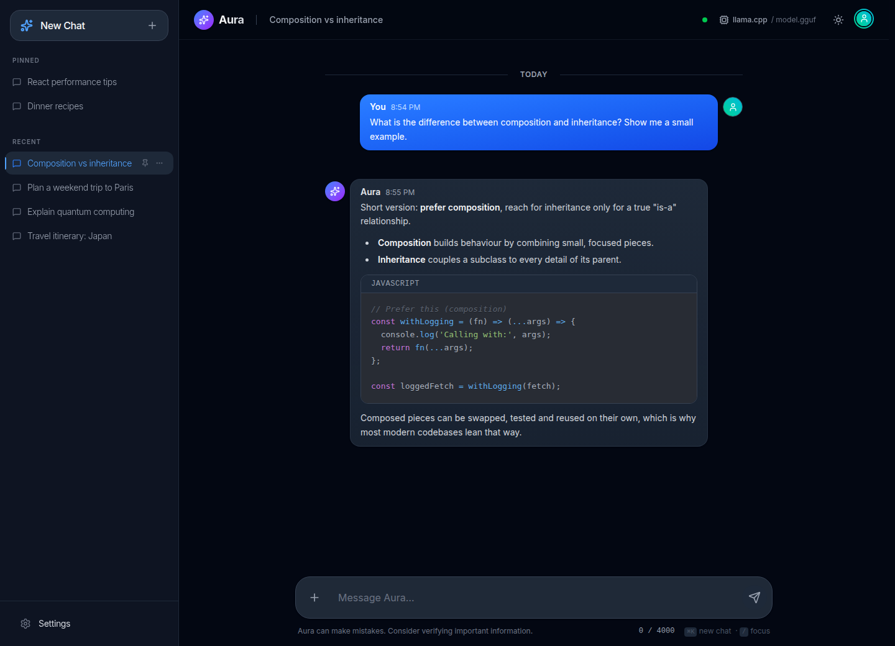
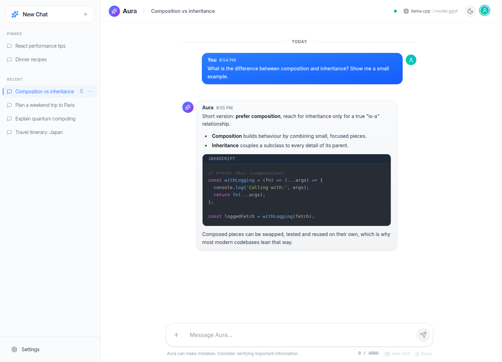
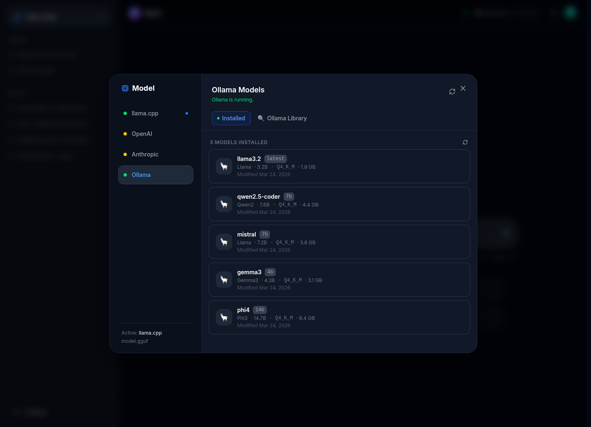

# Aura Chat

[](https://github.com/oliver021/llm-local-chat/actions/workflows/ci.yml)
[](LICENSE)

A self-hosted, ChatGPT-style chat interface for **llama.cpp**, **Ollama**, **OpenAI** and **Anthropic**.
One small Node server serves the UI, stores your conversations in SQLite and proxies to the model
servers, so API keys never reach the browser.

<table>
  <tr>
    <td></td>
    <td></td>
  </tr>
  <tr>
    <td colspan="2"></td>
  </tr>
</table>

## Features

- **Streaming chat** with a stop button that really cancels generation on the model server, plus
  message actions: regenerate, edit, copy and delete.
- **Conversations** that persist in SQLite: pin, rename, archive, copy, branch from any message,
  bookmark messages.
- **Model manager**: pick a provider and model from one dialog. Browse GGUF models on Hugging Face
  for llama.cpp, see what is installed in Ollama, list OpenAI and Anthropic models from their APIs.
- **Assistants and personalization**: reusable system prompts, custom instructions and memories that
  are sent with every request.
- **Light and dark themes**, color themes, compact mode, keyboard shortcuts
  (<kbd>Ctrl/⌘</kbd>+<kbd>K</kbd> new chat, <kbd>/</kbd> focus the input).
- **Private by default**: no accounts, no telemetry, no third-party requests except the Hugging Face
  model browser when you open it. The server only listens on `127.0.0.1` unless you change that.

## Quick start

### With Docker

```bash
git clone https://github.com/oliver021/llm-local-chat.git
cd llm-local-chat
docker compose up --build
```

Open <http://localhost:3000>. Conversations are kept in the `app-data` volume.

The container looks for model servers **on your machine**: llama-server on port 8080 and Ollama on
port 11434. Start one of them (see [Connecting models](#connecting-models)), then pick it from the
model button in the top bar. To run Ollama in a container instead, point the app at it and enable the profile:

```bash
echo "OLLAMA_URL=http://ollama:11434" >> .env
docker compose --profile ollama up -d --build
docker compose exec ollama ollama pull llama3.2
```

(`docker compose --profile llama up -d` does the same for llama.cpp: put a GGUF file in `./models`, set
`MODEL_FILE` and `LLAMA_SERVER_URL=http://llama-server:8080` in `.env`.)

### With Node

Requires Node.js 20.12 or newer (22 recommended, see `.nvmrc`).

```bash
git clone https://github.com/oliver021/llm-local-chat.git
cd llm-local-chat
npm ci
npm run dev:all        # UI on http://localhost:5173, API on http://localhost:3001
```

To run the production build instead:

```bash
npm run build
npm start              # UI and API together on http://localhost:3001
```

### Try it without a model

`npm run mock:llm` starts a tiny fake llama-server on port 8080 that streams a canned reply. Run it next
to `npm run dev:all` to explore the app with no model installed.

## Connecting models

| Provider | What you need | Notes |
|---|---|---|
| **llama.cpp** | `llama-server -m model.gguf --port 8080` | Default `LLAMA_SERVER_URL` is `http://localhost:8080`. |
| **Ollama** | `ollama serve` and `ollama pull llama3.2` | Default `OLLAMA_URL` is `http://localhost:11434`. |
| **OpenAI** | `OPENAI_API_KEY` in `.env` | Set `OPENAI_BASE_URL` to use any OpenAI-compatible service (OpenRouter, Groq, LM Studio, vLLM, ...). |
| **Anthropic** | `ANTHROPIC_API_KEY` in `.env` | |

Copy `.env.example` to `.env`, edit it and restart the server. The model dialog tells you which
providers are reachable and which are missing a key.

**Docker and models on the host.** Inside a container, `localhost` is the container itself, so compose
points at `host.docker.internal`. Ollama listens on `127.0.0.1` by default, which a container on Linux
cannot reach: start it with `OLLAMA_HOST=0.0.0.0 ollama serve`. Docker Desktop (macOS, Windows) needs no
change. llama-server needs `--host 0.0.0.0` for the same reason.

## Configuration

Everything is optional and read by the server from the environment, `.env.local` or `.env` (in that
order of precedence). See [`.env.example`](.env.example).

| Variable | Default | Purpose |
|---|---|---|
| `LLAMA_SERVER_URL` | `http://localhost:8080` (`host.docker.internal` in compose) | llama.cpp server |
| `OLLAMA_URL` | `http://localhost:11434` (`host.docker.internal` in compose) | Ollama server |
| `OPENAI_API_KEY` | none | Enables OpenAI |
| `OPENAI_BASE_URL` | `https://api.openai.com/v1` | OpenAI-compatible endpoint, including `/v1` |
| `ANTHROPIC_API_KEY` | none | Enables Anthropic |
| `ANTHROPIC_BASE_URL` | `https://api.anthropic.com` | Anthropic endpoint |
| `AUTH_PASSWORD` | none | Protects the whole app with HTTP Basic auth |
| `AUTH_USER` | `admin` | User name for Basic auth |
| `PORT` | `3001` (`3000` in Docker) | Port to listen on |
| `HOST` | `127.0.0.1` (`0.0.0.0` in Docker) | Interface to bind |
| `DATA_DIR` | `./data` (`/data` in Docker) | Where `chat.db` is stored |
| `DIST_DIR` | `./dist` | Built UI served by the server |
| `CORS_ORIGIN` | none | Comma-separated origins allowed cross-origin. Not needed normally. |

Docker compose also reads `APP_PORT` and `BIND_ADDRESS` (published port and interface, default
`127.0.0.1:3000`) and `MODEL_FILE` (GGUF file in `./models` for the optional `llama` profile).

## Security

- **API keys stay on the server.** The browser talks to `/api/proxy/openai` and `/api/proxy/anthropic`,
  and the server adds the key. The bundle contains no secrets.
- **Proxies are allow-lists.** Only the requests the app needs are forwarded (chat completions, model
  lists, a few read-only Ollama calls). Pulling or deleting Ollama models, OpenAI files and fine-tuning
  are not reachable through the app. Paths are normalised before matching, redirects are never followed,
  and request headers such as cookies are not passed on.
- **Local by default.** The server binds to `127.0.0.1`, and compose publishes the port on localhost only.
- **If you expose it** (`HOST=0.0.0.0`, `BIND_ADDRESS=0.0.0.0`, a reverse proxy, a tunnel), set
  `AUTH_PASSWORD` and serve it over HTTPS. Anyone who can reach the app can use the models and spend the
  API credits behind it. The server prints a warning when it is exposed without a password.
- The UI sends a Content-Security-Policy that blocks inline scripts and third-party hosts. The Docker
  image runs as a non-root user.

## How it works

```
Browser ── React UI ──────────────┐
                                  ▼
                   Express server (one process)
        ┌──────────────┬──────────────────┬───────────────────────────┐
        │ /api/chats   │ /v1              │ /api/proxy/openai         │
        │ /api/bookmarks│ /ollama         │ /api/proxy/anthropic      │
        ▼              ▼                  ▼                           ▼
     SQLite        llama-server        Ollama           OpenAI / Anthropic
                                                        (key added here)
```

In production the same server also serves the built UI. Read [docs/architecture.md](docs/architecture.md)
for the details and for how to add a provider.

## Project layout

```
App.tsx, index.tsx        React entry points
components/               UI (chat, sidebar, model selector, settings)
context/, hooks/          State: useChats is the heart of the app
services/                 Talking to providers (streaming, model discovery, error messages)
utils/                    API clients for the server, storage, formatting
server/                   Express app: config, auth, proxies, routes, SQLite
tests/                    Vitest: tests/client (jsdom) and tests/server (node)
e2e/                      Playwright smoke tests and a mock model server
docs/                     Architecture notes and screenshots
```

## Development

| Command | What it does |
|---|---|
| `npm run dev:all` | UI (Vite) and API (tsx watch) together |
| `npm run dev` / `npm run dev:server` | Either one on its own |
| `npm run build` | Builds the UI into `dist/` and the server into `dist-server/` |
| `npm start` | Runs the production build |
| `npm run lint` | ESLint, with zero warnings allowed |
| `npm run type-check` | TypeScript for the UI and the server |
| `npm test` | Unit and integration tests (Vitest) |
| `npm run test:coverage` | Same, with a coverage report |
| `npm run test:e2e` | Builds the app and runs the Playwright smoke tests |
| `npm run screenshots` | Regenerates the images in `docs/screenshots` |
| `npm run mock:llm` | Fake llama-server for demos and tests |

The e2e tests drive the Google Chrome that is installed on your machine and start their own copy of the
app and a mock model server, so they need no model and download no browser. Set `E2E_BROWSER=chromium`
after `npx playwright install chromium` if you do not have Chrome.

CI (`.github/workflows/ci.yml`) runs lint, type-check, unit tests, the build, the e2e tests and a Docker
build with a health check on every push and pull request.

## Status and limitations

Aura is a personal project that works end to end, with a few honest gaps:

- **Single user.** There are no accounts; `AUTH_PASSWORD` is one shared password.
- **Preview settings.** Web Search, MCP servers and Voice can be configured but are not used yet (the
  settings pages say so). File attachments are not supported.
- **Whole history at start-up.** The UI loads every conversation when it opens, so a very large history
  will make it slow to start.
- **No import or export** of conversations yet. The SQLite file in `DATA_DIR` is plain and easy to back up.

## Troubleshooting

**"Backend unreachable"** — the UI cannot reach the server. Use `npm run dev:all` (not just `npm run dev`)
or `docker compose up`.

**A provider shows a red or yellow dot** — open the model dialog; the line under the title says what is
missing, such as `Set OPENAI_API_KEY in .env and restart the server.`

**Docker cannot reach Ollama or llama-server on the host** — they must listen on all interfaces, see
[Connecting models](#connecting-models).

**`EADDRINUSE`** — something else uses the port. Set `PORT` (or `APP_PORT` for compose).

**`npm ci` fails building `better-sqlite3`** — it normally downloads a prebuilt binary. Use a supported
Node version (20.12+), or install a C++ toolchain (`build-essential` and `python3` on Debian/Ubuntu).

## License

[MIT](LICENSE)
